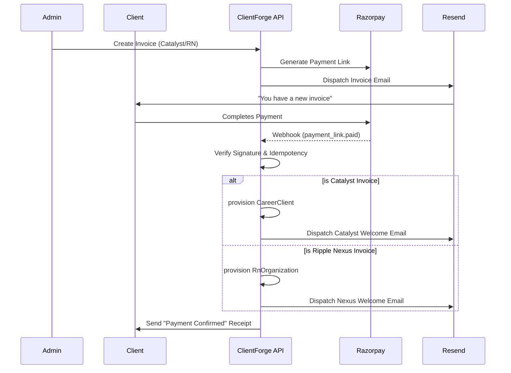
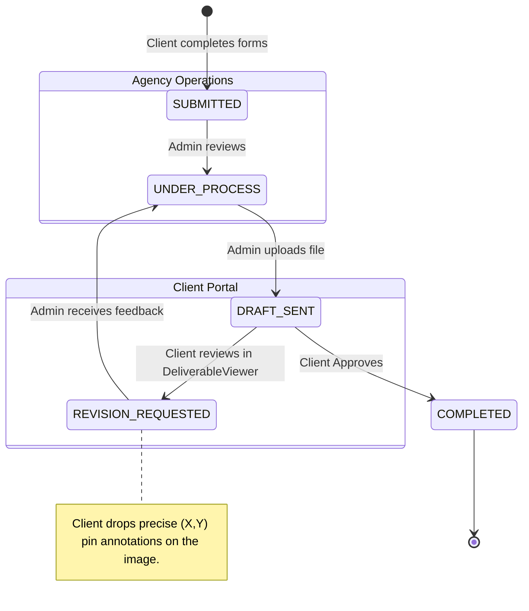
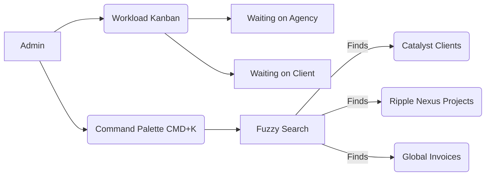

# ClientForge OS

ClientForge is a modern, full-stack Enterprise Operational OS designed to power both **Catalyst** (Career Services) and **Ripple Nexus** (B2B Agency Operations) from a unified backend while strictly isolating multi-tenant frontends. 

It is designed to handle high-touch, long-lifecycle client services—merging onboarding, invoicing, collaborative deliverables, and asynchronous communication into a single pane of glass.

---

## 🏗 System Architecture

ClientForge uses Next.js 14 (App Router) on the frontend and backend, with a PostgreSQL database (Prisma ORM) and Tailwind CSS for styling. The core design principle is **strict tenant isolation** at the middleware layer.

```mermaid
graph TD
    subgraph Clients
      C[Catalyst Client]
      RN[Ripple Nexus Client]
    end
    
    subgraph Vercel Edge
      M{Middleware.ts}
    end
    
    subgraph ClientForge Application
      subgraph Catalyst Sector
        CP[Career Portal]
        CA[Career Admin]
      end
      
      subgraph Ripple Nexus Sector
        RNP[B2B Portal]
        RNA[B2B Admin]
      end
      
      subgraph Shared Core
        GCP[Global Command Palette]
        Search[Unified /api/search]
        Kanban[Workload Kanban]
      end
    end
    
    subgraph Data Layer
      DB[(PostgreSQL NeonDB)]
      R[Razorpay Webhooks]
      E[Resend Emails]
    end

    C --> M
    RN --> M
    
    M -- "tenant: catalyst" --> CP
    M -- "tenant: ripple_nexus" --> RNP
    
    CP --> DB
    CA --> DB
    RNP --> DB
    RNA --> DB
    
    Shared Core --> DB
    R --> Shared Core
    Shared Core --> E
```

---

## 💳 Payment & Onboarding Workflow

The invoice and payment pipeline operates completely idempotently, triggering distinct onboarding flows based on the attached product/service.



---

## 💬 Client Portal & Deliverable Annotation Flow

ClientForge enables precise, asynchronous feedback loops on design deliverables and documents.



---

## 🛡 Admin Workload Management

Managing hundreds of high-touch clients is streamlined via the **Global Command Palette** and the **Workload Kanban**.



---

## 🚀 Deployment & Environment

**Tech Stack:**
* **Framework:** Next.js 14 (App Router)
* **Database:** PostgreSQL (Neon Serverless)
* **ORM:** Prisma
* **Styling:** Tailwind CSS + Framer Motion
* **Payments:** Razorpay
* **Emails:** Resend + React Email

**Required Environment Variables:**
```env
# Database
DATABASE_URL=
DIRECT_URL=

# App Configuration
NEXT_PUBLIC_APP_URL=
ADMIN_SESSION_SECRET=

# Third-Party Integrations
RESEND_API_KEY=
RAZORPAY_KEY_ID=
RAZORPAY_KEY_SECRET=
RAZORPAY_WEBHOOK_SECRET=
```
